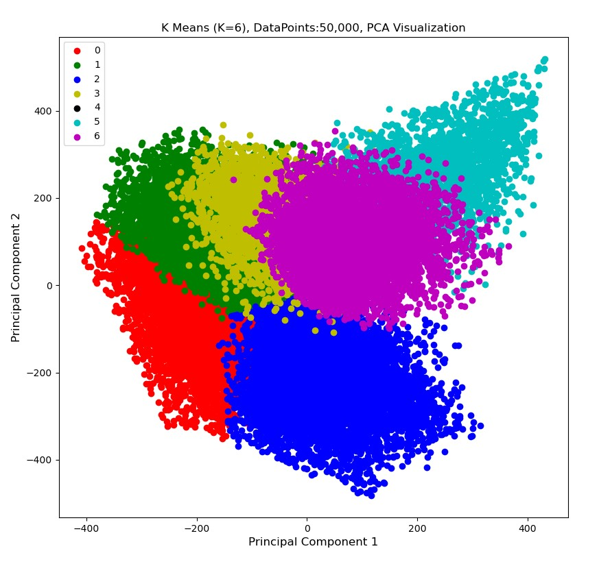

# k-means-clustering
Implement k-means clustering on CIFAR10 dataset

Dataset: [CIFAR10](https://www.cs.toronto.edu/~kriz/cifar.html). Download the "CIFAR 10 python version" and place it in a folder named "data". This code uses the 50000 training images. 

Result of k-means clustering of training images of CIFAR10 dataset, using 2 principal components.

